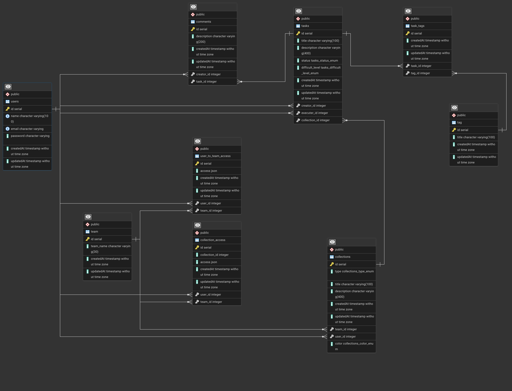

# KanFlow

**KanFlow** — это веб-приложение для визуализации и управления проектами, использующий Канбан-систему для визуализации потока задач. Система позволяет удобно следовать Agile-практикам, структурировать задачи, распределять нагрузку и отслеживать прогресс выполнения проектов.
**Назначение системы:** Автоматизация контроля задач, улучшение прозрачности командной работы и личного планирования.

**Целевая аудитория:** Разработчики, менеджеры проектов, студенческие команды и все, кто работает над совместными IT-проектами.

---

## 📄 Документация
* ТЗ: https://docs.google.com/document/d/1AgOAv6Qv9e3RC8hZ-6bkMw8Fi5hWxfPCWRStbiBNO8M/edit?usp=sharing

---

## 🗄 ER-диаграмма
Ниже представлена схема базы данных, описывающая связи между пользователями, командами, досками (коллекциями), задачами и комментариями, а также систему контроля доступа (ABAC).



---

## 🎨 Макеты интерфейса
В системе реализованы следующие основные экраны:
1. Страницы авторизации и регистрации
2. Главная страница
3. Страница со всеми досками с системой фильтрации
4. Страница профиля пользователя
5. Страница команды
6. Страница доски с колонками для задач (Backlog, To Do, In Progress, In Review, Done)
7. Страница настроек

* Макет дизайна Figma https://www.figma.com/make/51pxazXK0ohXd5xIcKEMJs/Minimalist-Kanban-Board-UI?t=fHDMPF3gSFSrSdji-1
---

## 🏗 Описание архитектуры системы
Проект разделен на клиентскую и серверную части, взаимодействующие по протоколу HTTP (REST API) в формате JSON, а также использующие WebSockets для обновлений в реальном времени.

**Стек технологий:**
* **Frontend (Client):** React, TypeScript, Hey API.
* **Backend (Server):** NestJS, TypeORM, Swagger, Socket.io.
* **База данных:** PostgreSQL.
* **Аутентификация:** JWT.

---

## 📡 Описание API

> 💡 Полная интерактивная документация API доступна через Swagger UI после запуска сервера по адресу: `http://localhost:[PORT]/api/` (порт и путь зависят от ваших настроек NestJS).

### Auth
* `POST /api/auth/register` — Регистрация нового пользователя
* `POST /api/auth/login` — Вход в аккаунт
* `POST /api/auth/me` — Проверка токена пользователя
* `POST /api/auth/logout` — Выход из аккаунта
* `POST /api/auth/refresh` — Обновление JWT токена

### Users
* `POST /api/users` — Создание аккаунта пользователя (админ-метод)
* `GET /api/users` — Получение списка всех пользователей
* `GET /api/users/{id}` — Получение пользователя по ID
* `PATCH /api/users/{id}` — Обновление данных пользователя
* `DELETE /api/users/{id}` — Удаление пользователя

### Teams (Команды)
* `POST /api/teams` — Создание команды
* `GET /api/teams` — Получение списка всех команд
* `GET /api/teams/{id}` — Получение команды по ID
* `PATCH /api/teams/{id}` — Обновление команды
* `DELETE /api/teams/{id}` — Удаление команды

### Collections (Доски)
* `POST /api/collection` — Создание новой доски (коллекции)
* `GET /api/collection/{id}` — Поиск доски по ID
* `PATCH /api/collection/{id}` — Обновление параметров доски
* `DELETE /api/collection/{id}` — Удаление доски

### Tasks (Задачи)
* `POST /api/tasks/createTask` — Создание новой задачи
* `GET /api/tasks/{collection_id}` — Получение всех задач на конкретной доске
* `PATCH /api/tasks/{id}` — Обновление задачи (включая смену статуса/колонки)
* `DELETE /api/tasks/{id}` — Удаление задачи

### Comments (Комментарии)
* `POST /api/comment` — Создание комментария к задаче
* `GET /api/comment/{task_id}` — Получение всех комментариев к задаче
* `PATCH /api/comment/{id}` — Обновление комментария
* `DELETE /api/comment/{id}` — Удаление комментария

### Access Management
**К командам:**
* `POST /api/access_team` — Создание прав доступа
* `GET /api/access_team/` — Поиск прав конкретного пользователя
* `GET /api/access_team/{id}`— Поиск всех прав в рамках команды
* `PATCH /api/access_team/{id}` — Обновление прав
* `DELETE /api/access_team/{id}` — Удаление прав

**К доскам (коллекциям):**
* `POST /api/access_collection` — Создание прав доступа
* `GET /api/collection-access/{collection_id}/{user_id}` - ищем права человека в определенной доске

---

## 🚀 Инструкции по запуску проекта

### Предварительные требования
* Node.js (рекомендуется v18+)
* npm, yarn или pnpm
* PostgreSQL 

### 1. Запуск проекта fronted/backend
Запустите PostgreSQL.

Создайте файл .env в папке server
```Bash
# Файл .env
PORT = 3000
JWT_SECRET = 'KANFLOW_SECRET'

В терминале:

```bash
cd backend
# Установка зависимостей для Backend
npm i
# Запуск сервера в режиме разработки
npm run start:dev

cd frontend
# Установка зависимостей для Frontend
npm i
#Запуск Frontend
npm run dev